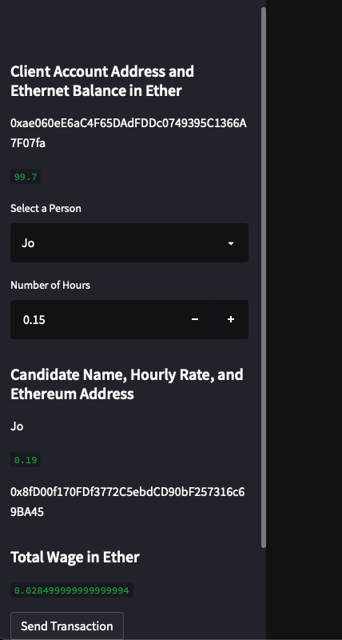
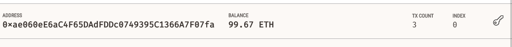
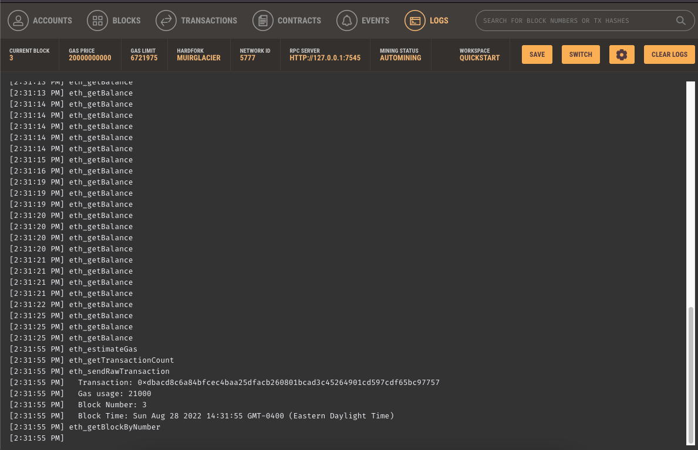

# **Challenge_19**

---

## *Hiring a fintech professional and transfering ether to them*

## We used streamlit to find a fintech professional. We added our wallet as the sender and the fintech professional as a receiver then we were able to have business transactions by sending ether. 

## Illustration of the transaction

